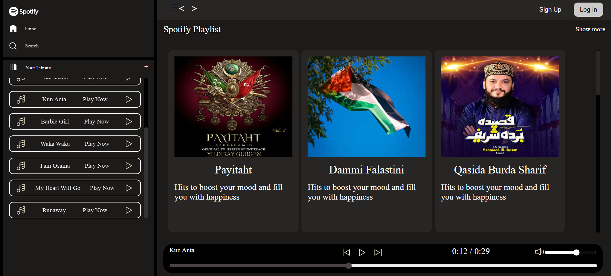

<h1 align="center">
  
  <br>
  <b>🎵 Spotify Clone 🎧</b>
  <br>
  
</h1>

<p align="center">
  <a href="#features">Features</a> •
  <a href="#installation">Installation</a> •
  <a href="#screenshots">Screenshots</a> •
  <a href="#technologies-used">Tech Stack</a> •
  <a href="#credits">Credits</a> •
  <a href="#contact">Contact</a>
</p>

---

## 🎯 Project Overview

**Spotify Clone** is a responsive and modern music streaming web app inspired by the original Spotify UI. Built using **HTML, CSS, and JavaScript**, this clone demonstrates front-end design, user interactivity, and media controls. Play/pause songs, control volume, see current song info, and enjoy a Spotify-like experience right from your browser.

---

## 🚀 Features

- 🎼 Stylish, responsive layout inspired by Spotify
- ▶️ Play, pause, previous & next song controls
- 🔊 Volume slider and mute/unmute toggle
- 🕐 Real-time progress bar & total song duration
- 📱 Mobile-friendly layout with flex and grid systems
- 🎨 SVG icons for clean, scalable visuals
- 📁 Organized file structure for HTML, CSS, JS

---

## 💻 Installation

### ▶️ Local Setup
1. Clone the repository:
```bash
git clone https://github.com/salman-ahmed-2/spotify-clone.git
cd spotify-clone
```
2. Open index.html in your preferred browser.

✅ No dependencies required — Pure HTML, CSS & JS!

📸 Screenshots
Experience the clean and modern interface:

<p align="center">  </p><br><br> 
<p align="center">  </p>


##  Stats

<p align="center">
  
  <br><br>
  
  <br><br>
  
</p>

---


🙌 Credits
🎨 Inspired by Spotify UI

📁 Icons from FontAwesome and SVGRepo

💻 Project by Salman Ahmed Khan (FAST NUCES)

📬 Contact
Let’s connect and build more cool projects!

📧 Email: salmanahmed32121@gmail.com

💼 LinkedIn: Salman Ahmed Khan

🧑‍💻 GitHub: salman-ahmed-2

© 2025 Salman Ahmed Khan — All rights reserved.
